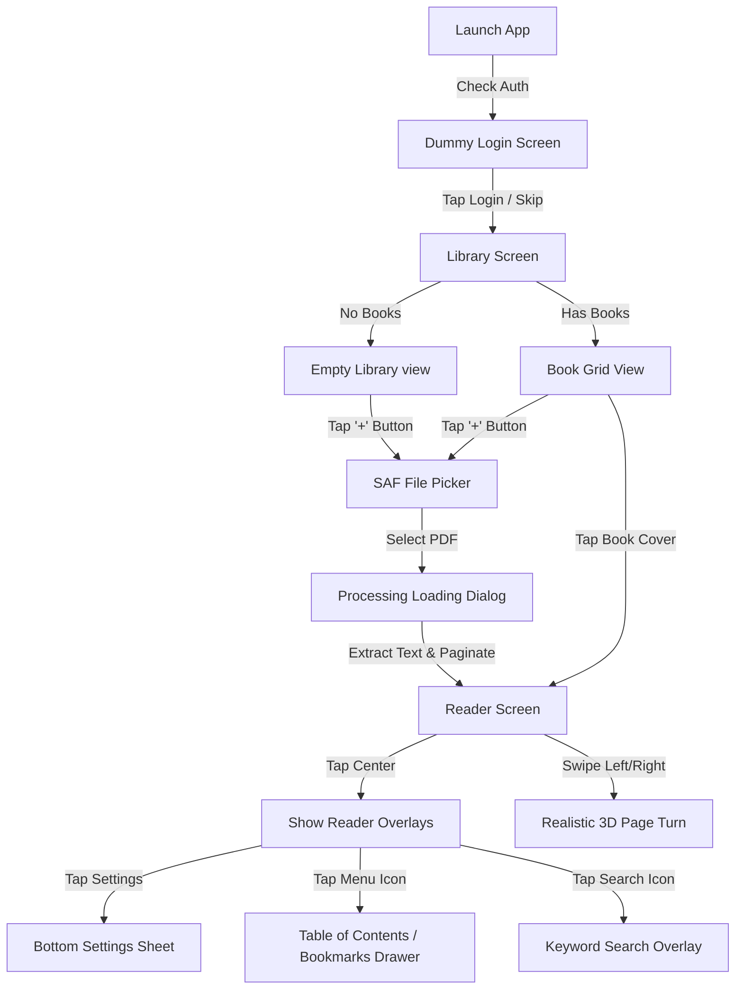

# App Flow - Paperback Book Reader

This document defines the screen-by-screen user flow, user actions, and state transitions within the **Paperback** application.

---

## 1. User Journey Flowchart

---

## 2. Detailed Screen Transitions

### Screen 1: Dummy Login / Welcome
- **Visuals**: Serif typography title "Paperback" centered over a soft cream sepia backdrop, a subtle logo illustration, dummy input fields for email/password, and a prominent "Enter Library" button.
- **User Action**: 
  - User inputs dummy details or leaves them blank and taps **Enter Library**.
- **Result**: Authenticated state is saved in shared preferences, and the app transitions to the **Library Screen**. Subsequent app launches skip this screen.

### Screen 2: Home / Library Screen
- **Visuals**: Minimalist design with a top header "My Paperback Shelf". If empty, an elegant drawing of an empty bookshelf is shown with a text prompt: *"Your shelf is currently empty. Start your reading journey by importing a PDF."* A warm gold/bronze FAB with a `+` icon sits at the bottom right.
- **User Action**:
  - Tapping the `+` FAB launches the Android **Storage Access Framework (SAF) Document Picker** (mime-type: `application/pdf`).
  - Selecting a PDF launches the **PDF Processing Loader** overlay.
  - If books are already present: Tapping any book card opens it directly in the **Reader Screen** at its last-read page.
  - Long-pressing a book card shows a dialog to delete the book from local storage.

### Screen 3: PDF Processing Loader (Overlay)
- **Visuals**: A smooth modal dialog containing a progress spinner and status messages (e.g., *"Importing PDF..."*, *"Parsing Chapters..."*, *"Reflowing Pages..."*).
- **Process**:
  1. The app copies the PDF file to the internal files directory.
  2. PDFBox parses the text and builds the Table of Contents in a background thread.
  3. The cover page (page 0) is rasterized using `PdfRenderer` and saved to `covers/`.
  4. Once complete, the database record is inserted, the loader dismisses, and the user is routed to the **Reader Screen**.

### Screen 4: Reader Screen
- **Visuals**: A clean, distraction-free text view formatted with Lora/Playfair Display serif font, warm sepia paper background, and soft book shadows. The UI controls are hidden by default to keep the screen uncluttered.
- **Interactions**:
  - **Swipe Horizontal**: Invokes the custom `BookPageTransformer` 3D fold page transition.
  - **Single Tap Center**: Toggles visibility of the top and bottom controls:
    - **Top Toolbar**: Back button, book title, chapter title, search button, drawer menu toggle, and bookmark quick-toggle.
    - **Bottom Reading Progress**: A subtle progress bar showing page numbers (e.g., *"Page 12 of 180"*) and a slider to quickly jump pages.
  - **Double Tap or Pinch-to-Zoom**: Zooms the current reflowed page layout for ease of reading.

### Screen 5: Table of Contents & Bookmarks Navigation Drawer
- **Trigger**: Tap the menu icon in the reader's top toolbar.
- **Visuals**: Slide-out panel from the left containing two tabs:
  1. **Table of Contents (TOC)**: List of chapters extracted from the PDF. Tapping a chapter jumps directly to its corresponding page.
  2. **Saved Bookmarks**: List of saved pages with timestamps and preview thumbnails. Tapping a bookmark jumps to that page.

### Screen 6: Reading Comfort Bottom Sheet Settings
- **Trigger**: Tap the settings cog icon in the reader's top/bottom bar.
- **Visuals**: Slides up from the bottom containing control blocks:
  - **Theme**: Light, Sepia, Dark Charcoal toggle buttons.
  - **Font Family**: Serif (Lora), Vintage (Playfair Display), Modern (Sans-serif).
  - **Font Size**: `- A A +` buttons.
  - **Margins**: Narrow, Standard, Wide margin selectors.
  - **Line Height**: Line spacing options (1.0x, 1.2x, 1.5x).
  - **App Brightness**: A slider overriding system brightness.
- **Behavior**: Modifying any setting triggers background recalculation of the pagination engine, dynamically rebuilding the pages and refreshing the current `ViewPager2` position without visual jarring.
