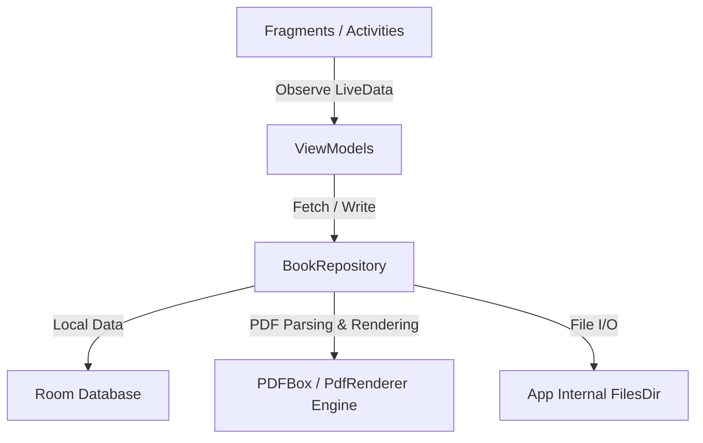

# Technical Requirement Document (TRD) - Paperback Book Reader

This document details the architecture, data models, algorithm specifications, and directory structure for the **Paperback** Android application.

---

## 1. Architectural System Design
Paperback follows the Android Clean Architecture and MVVM pattern, using Jetpack Components:



### Key Libraries & Dependencies
- **Room DB (`androidx.room`)**: Manages structured persistent data (Books, Bookmarks).
- **PDFBox for Android (`com.tom-roush:pdfbox-android`)**: Used for background text extraction, document outline (TOC) traversal, and full-text keyword searches.
- **Android Native `PdfRenderer`**: Used to rasterize page 0 of the PDF to generate a PNG book cover thumbnail.
- **ViewPager2 & PageTransformer**: Used to host paginated text blocks and apply 3D page curl transitions.

---

## 2. Data Models (Room DB)

### 2.1. Book Entity
```kotlin
@Entity(tableName = "books")
data class Book(
    @PrimaryKey(autoGenerate = true) val id: Long = 0,
    val title: String,
    val author: String?,
    val localFilePath: String, // Path in app internal storage (filesDir/books/...)
    val coverPath: String,     // Path to cover thumbnail (filesDir/covers/...)
    val lastPageRead: Int = 0, // Maps to the paginated index
    val totalPages: Int = 0,   // Number of PDF source pages (or computed pages)
    val addedDate: Long = System.currentTimeMillis()
)
```

### 2.2. Bookmark Entity
```kotlin
@Entity(
    tableName = "bookmarks",
    foreignKeys = [
        ForeignKey(
            entity = Book::class,
            parentColumns = ["id"],
            childColumns = ["bookId"],
            onDelete = ForeignKey.CASCADE
        )
    ]
)
data class Bookmark(
    @PrimaryKey(autoGenerate = true) val id: Long = 0,
    val bookId: Long,
    val pageNumber: Int,       // The paginated index at the time of bookmarking
    val previewPath: String?,  // Optional thumbnail preview image path
    val timestamp: Long = System.currentTimeMillis()
)
```

---

## 3. Core Engine Algorithms

### 3.1. Dynamic Reflow & Pagination Engine
To display PDF text as a reflowable paperback book, the app extracts raw text and paginates it dynamically depending on screen dimensions, margins, and typography options.

```kotlin
class PaginationEngine(
    private val textPaint: TextPaint,
    private val pageHeight: Int,
    private val pageWidth: Int,
    private val lineSpacingMultiplier: Float = 1.2f
) {
    fun paginate(fullText: String): List<String> {
        val pages = mutableListOf<String>()
        var startOffset = 0
        val textLength = fullText.length

        while (startOffset < textLength) {
            // Using StaticLayout to measure text heights fitting the canvas
            val staticLayout = StaticLayout.Builder.obtain(
                fullText,
                startOffset,
                textLength,
                textPaint,
                pageWidth
            )
            .setLineSpacing(0f, lineSpacingMultiplier)
            .build()

            // Find how many lines fit within the page height
            var lineCount = 0
            var currentHeight = 0
            while (lineCount < staticLayout.lineCount) {
                val nextHeight = staticLayout.getLineBottom(lineCount)
                if (nextHeight > pageHeight) {
                    break
                }
                currentHeight = nextHeight
                lineCount++
            }

            if (lineCount == 0) {
                // Prevent infinite loop if a single line is larger than pageHeight
                lineCount = 1
            }

            // Extract the fitting text segment
            val endOffset = staticLayout.getLineEnd(lineCount - 1)
            pages.add(fullText.substring(startOffset, endOffset))
            startOffset = endOffset
        }
        return pages
    }
}
```

### 3.2. 3D Book Page Transformer
Applies folding rotations and shadows to simulate page turning in `ViewPager2`.
```kotlin
class BookPageTransformer : ViewPager2.PageTransformer {
    override fun transformPage(page: View, position: Float) {
        val shadowView = page.findViewById<View>(R.id.page_shadow_overlay)
        val container = page.findViewById<View>(R.id.page_container)

        page.cameraDistance = 20000f

        when {
            position < -1 -> { // [-Infinity,-1)
                page.alpha = 0f
            }
            position <= 0 -> { // [-1,0]
                page.alpha = 1f
                // Rotate left side page around left edge
                page.pivotX = 0f
                page.rotationY = 120f * position
                // Prevent shifting
                page.translationX = -position * page.width
                // Darken shadow overlay
                shadowView?.alpha = -position * 0.8f
            }
            position <= 1 -> { // (0,1]
                page.alpha = 1f
                // Keep next page static behind the turning page
                page.pivotX = 0f
                page.rotationY = 0f
                page.translationX = -position * page.width
                // Shadow fades out
                shadowView?.alpha = (1f - position) * 0.3f
            }
            else -> { // (1,+Infinity]
                page.alpha = 0f
            }
        }
    }
}
```

---

## 4. File Caching & Directory Structure
Internal directories under `context.filesDir`:
- `/books/`: Contains copy of imported PDF documents. Filename format: `book_[id].pdf`.
- `/covers/`: Contains generated cover PNG thumbnails. Filename format: `cover_[id].png`.
- `/bookmarks/`: Contains optional page preview images for bookmarks. Filename: `bookmark_[id].png`.

---

## 5. Security & Isolation Constraints
1. **Scoped Storage Compliance**: No legacy storage permissions (`READ_EXTERNAL_STORAGE`) requested. The app imports files exclusively via Storage Access Framework (`Intent.ACTION_OPEN_DOCUMENT`) which handles temporary SAF permissions before copying files locally.
2. **Resource Constraints**:
   - PDFBox runs text extraction tasks on `Dispatchers.IO` threads to keep the UI Thread at 60fps.
   - Text pagination is debounced or pre-computed in background threads when settings (like font size) change.
